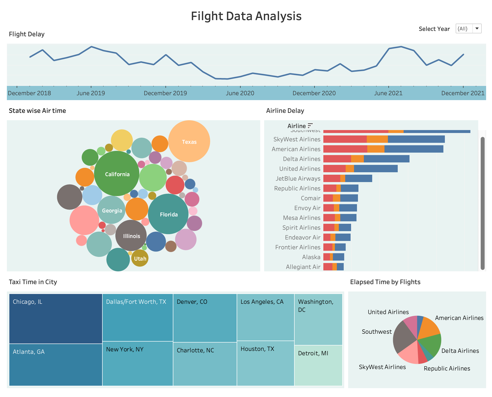

# Flight Data Analysis / Flight Status BI Project

This project analyzes 19M+ flight records (sourced from Kaggle in Parquet format) to uncover trends in delays, taxi times, and cancellations—driving insights for improved airline scheduling and operational efficiency.

## Dashboard

## Technologies
- **ETL Processing:** Apache Spark (PySpark)
- **Data Warehousing:** Google BigQuery with a star schema for scalable OLAP analytics
- **Visualization:** Tableau for interactive dashboards
- **Development:** Python & Jupyter Notebook

## Project Components

### ETL Workflow
- **Data Extraction:** Extracted flight records from Parquet files.
- **Data Processing:** Processed and transformed raw data using Spark and Python.
- **Automation:** Automated incremental updates to the data warehouse to integrate new flight records, airlines, and airports.

### Data Warehouse Design
- **Schema Design:** Implemented a star schema in Google BigQuery.
- **OLAP Queries:** Developed comprehensive OLAP queries to facilitate multi-dimensional analysis, leading to faster and more scalable analytics.

### Business Intelligence
- **Dashboard Development:** Built interactive dashboards using Tableau that integrate directly with BigQuery.
- **Strategic Reporting:** Provided stakeholders (executives, business analysts, operations teams, and marketing teams) with high-level and detailed reports to drive strategic decision-making.

## License
This project is licensed under the MIT License.
